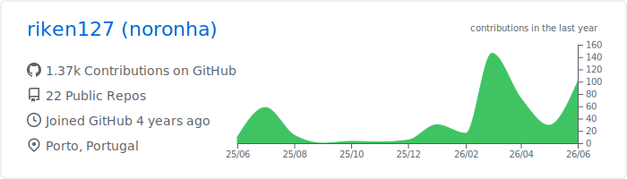
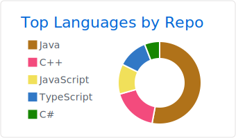
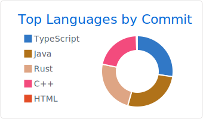

# riken

Software developer.

Mostly working around backend systems, lightweight services, and infrastructure tooling.  
Interested in distributed systems, Linux, C++, Java, and low-level programming.

I prefer simple designs, explicit architecture, and software that is easy to reason about.

---

  

  
  

